# Introduction and Background
The application of machine learning in retail is essential as companies seek to deliver personalized shopping experiences. The explosion of AI has led to retailers being able to improve customer experiences through better product recommendations, as well as improvements to search and customer support.

## Literature Review
This project starts by using unsupervised learning methods to form clusters of similar customers and clothing articles. Clustering is powerful in the world of ecommerce because it allows us to make decisions based on similarity. In this project, we use both K-Means and DBSCAN to do clustering. Clustering algorithms depend on the underlying structure of the data, and the two methods we used rely on different underlying structures. Because K-means is based on distance, it effectively clusters circles or spheres in the data. On the other hand, DBSCAN is based on density, so it can capture arbitrary shapes. The shape of clothing article and customer data depends on the attributes that are recorded, so we must experiment with both.

This project also evaluates XGBoost, LightGBM, and other supervised methods for analyzing customer behavior, clustering products, and building recommendation systems using the H&M dataset. XGBoost efficiently handles large-scale datasets for customer behavior prediction [1]. LightGBM, known for speed and performance, enhances prediction accuracy in high-dimensional data [2,3]. These models will be leveraged individually or in combination to offer personalized recommendations based on past interactions. Unsupervised methods are also evaluated. 

## Dataset Description
The dataset for this project is the H&M Personalized Fashion Recommendations dataset. This multi-modal dataset provides us with several ways of tackling this problem. 

The dataset consists of:

1. `images/` directory with subdirectories of article IDs
   - **Note**: 437/105,542 articles are missing images
2. `articles.csv` article metadata
   - 25 columns including product name, type, color, description
3. `customers.csv` customer metadata
   - 7 columns including age, post-code, fashion newsletter recipient
4. `transactions_train.csv` contains dated transactions with customer, article, price data

## Dataset Link: [H&M Personalized Fashion Recommendation Dataset](https://www.kaggle.com/competitions/h-and-m-personalized-fashion-recommendations)

---

# Problem Definition
We aim to create a personalised product recommendation system for H&M Group by helping users discover items that match their interests. Product recommendations will be generated based on data from previous transactions of customers. We will predict up to 12 labels of articles, which the customer might buy in the next 7-day period after the training time period.

## Motivation
A good recommendation system can increase sales by recommending customers the products they’re likely to buy, saving them time in their search. There’s also a sustainability aspect to consider. When customers find the right products, it can lead to fewer returns, which in turn reduces the environmental impact from shipping and waste.

---

# Methods

## Data Preprocessing Methods

1. **TF-IDF** - Term Frequency-Inverse Document Frequency (TF-IDF) for extracting insights from product descriptions.
2. **SVD** - Singular Value Decomposition (SVD) Reduced the dimensionality of TF-IDF vectors to create compact representations of articles.
3. **Categorical and One-hot encoding** - Change the text labels into numerical labels.
4. **PCA** - Principal Component Analysis for dimensionality reduction. Most important features are extracted before feeding the ML algorithms.
5. **t-SNE** - t-Distributed Stochastic Neighbor Embedding (t-SNE) for visualization. t-SNE reduces high-dimensional data to a 2D space, helping to reveal patterns and clusters visually, aiding exploratory analysis and clustering.
6. **Hex to Integer Encoding** - Convert hexadecimal values to integers for better processing.
7. **Negative Sampling** - For supervised learning, we used negative sampling to balance the dataset and prevent the model from being biased towards positive samples.
8. **Best Seller Ranking** - We ranked the articles based on the number of times they were purchased to identify the best-selling items.

### Exploratory Data Analysis (EDA)
An important part of any Machine Learning project is to come to know your data through EDA. For this project we extensively explored the articles, customers, and transactions datasets to find patterns in the data that we could leverage.

#### Articles
The articles dataset provides us important numerical and categorical data about clothes sold at H&M. Features such as the type and color of products enable us to find visually similar clothing articles.
##### Articles Data Sample
|index|article\_id|product\_code|prod\_name|product\_type\_no|product\_type\_name|product\_group\_name|graphical\_appearance\_no|graphical\_appearance\_name|colour\_group\_code|colour\_group\_name|perceived\_colour\_value\_id|perceived\_colour\_value\_name|perceived\_colour\_master\_id|perceived\_colour\_master\_name|department\_no|department\_name|index\_code|index\_name|index\_group\_no|index\_group\_name|
|---|---|---|---|---|---|---|---|---|---|---|---|---|---|---|---|---|---|---|---|---|
|0|108775015|108775|Strap top|253|Vest top|Garment Upper body|1010016|Solid|9|Black|4|Dark|5|Black|1676|Jersey Basic|A|Ladieswear|1|Ladieswear|
|1|108775044|108775|Strap top|253|Vest top|Garment Upper body|1010016|Solid|10|White|3|Light|9|White|1676|Jersey Basic|A|Ladieswear|1|Ladieswear|
|2|108775051|108775|Strap top \(1\)|253|Vest top|Garment Upper body|1010017|Stripe|11|Off White|1|Dusty Light|9|White|1676|Jersey Basic|A|Ladieswear|1|Ladieswear|
|3|110065001|110065|OP T-shirt \(Idro\)|306|Bra|Underwear|1010016|Solid|9|Black|4|Dark|5|Black|1339|Clean Lingerie|B|Lingeries/Tights|1|Ladieswear|
|4|110065002|110065|OP T-shirt \(Idro\)|306|Bra|Underwear|1010016|Solid|10|White|3|Light|9|White|1339|Clean Lingerie|B|Lingeries/Tights|1|Ladieswear|

##### Articles Feature Exploration
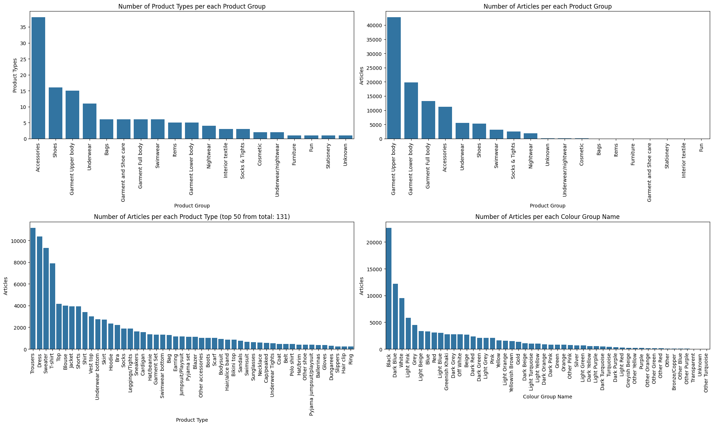
#### Customers
The customers dataset provides us important numerical and categorical data about H&M shoppers. Two features that stand out that will help group similar customers are the postal code and age of customers.
##### Customers Data Sample
|index|customer\_id|FN|Active|club\_member\_status|fashion\_news\_frequency|age|postal\_code|
|---|---|---|---|---|---|---|---|
|0|00000dbacae5abe5e23885899a1fa44253a17956c6d1c3d25f88aa139fdfc657|NaN|NaN|ACTIVE|NONE|49\.0|52043ee2162cf5aa7ee79974281641c6f11a68d276429a91f8ca0d4b6efa8100|
|1|0000423b00ade91418cceaf3b26c6af3dd342b51fd051eec9c12fb36984420fa|NaN|NaN|ACTIVE|NONE|25\.0|2973abc54daa8a5f8ccfe9362140c63247c5eee03f1d93f4c830291c32bc3057|
|2|000058a12d5b43e67d225668fa1f8d618c13dc232df0cad8ffe7ad4a1091e318|NaN|NaN|ACTIVE|NONE|24\.0|64f17e6a330a85798e4998f62d0930d14db8db1c054af6c9090f7dd3e38380dc|
|3|00005ca1c9ed5f5146b52ac8639a40ca9d57aeff4d1bd2c5feb1ca5dff07c43e|NaN|NaN|ACTIVE|NONE|54\.0|5d36574f52495e81f019b680c843c443bd343d5ca5b1c222539af5973a23ae6d|
|4|00006413d8573cd20ed7128e53b7b13819fe5cfc2d801fe7fc0f26dd8d65a85a|1\.0|1\.0|ACTIVE|Regularly|52\.0|25fa5ddee9aac01b35208d01736e57942317d756b32ddd4564743b005a805b1d|

#### Transactions
The transactions dataset is a timeseries of articles purchased by customers. It has important features that will help with predictions such as the price of the item and date of purchase.
|index|t\_dat|customer\_id|article\_id|price|sales\_channel\_id|
|---|---|---|---|---|---|
|0|2018-09-20|000058a12d5b43e67d225668fa1f8d618c13dc232df0cad8ffe7ad4a1091e318|663713001|0\.0508305084745762|2|
|1|2018-09-20|000058a12d5b43e67d225668fa1f8d618c13dc232df0cad8ffe7ad4a1091e318|541518023|0\.0304915254237288|2|
|2|2018-09-20|00007d2de826758b65a93dd24ce629ed66842531df6699338c5570910a014cc2|505221004|0\.0152372881355932|2|
|3|2018-09-20|00007d2de826758b65a93dd24ce629ed66842531df6699338c5570910a014cc2|685687003|0\.0169322033898305|2|
|4|2018-09-20|00007d2de826758b65a93dd24ce629ed66842531df6699338c5570910a014cc2|685687004|0\.0169322033898305|2|
##### Customers and Transactions Feature Exploration
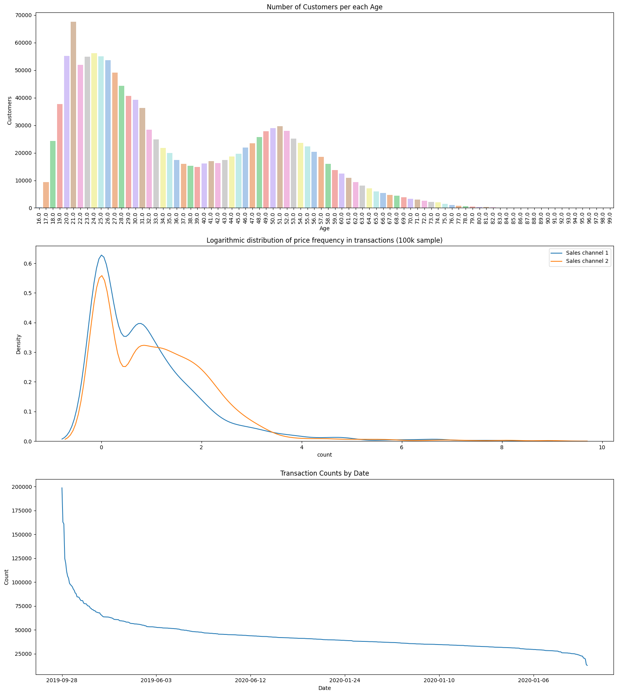

### One-Hot Encoding (OHE)
For our project, we explored one-hot encoding as a method to preprocess categorical data in the articles dataset. One-hot encoding is a popular technique that transforms categorical values into a series of binary columns. However, due to the nature of the dataset, this method presented specific challenges and led us to consider alternative encoding strategies.

#### Initial One-Hot Encoding Attempt

We initially selected columns for one-hot encoding based on the criteria that they were integer columns with a limited number of unique values (≤500). This approach was designed to reduce the dimensionality of the encoding process and focus on features with manageable levels of categorical diversity. The columns identified for one-hot encoding included:

	•	product_type_no
	•	graphical_appearance_no
	•	colour_group_code
	•	perceived_colour_value_id
	•	perceived_colour_master_id
	•	department_no
	•	index_group_no
	•	section_no
	•	garment_group_no

The resulting one-hot encoded matrix had a shape of (105,542, 622), indicating that the dimensionality had grown substantially. Given the high dimensionality and sparsity of this encoding, it became computationally unrealistic for our purposes, potentially leading to overfitting and slowing down model training.

#### Transition to Ordinal Encoding

To mitigate these issues, we switched to ordinal encoding. Ordinal encoding assigns unique numerical values to each category, thereby preserving the categorical information without drastically increasing dimensionality. We applied this technique to the following columns:

	•	product_code
	•	product_type_no
	•	product_group_name
	•	graphical_appearance_no
	•	colour_group_code
	•	perceived_colour_value_id
	•	perceived_colour_master_id
	•	department_no
	•	index_code
	•	index_group_no
	•	section_no
	•	garment_group_no

This approach allowed us to retain essential categorical information in a format compatible with our machine learning models while controlling the dimensionality and computational requirements.

### Text Preprocessing

The detail_desc column in the articles dataset provides valuable textual descriptions for each item, allowing us to extract meaningful features. Our preprocessing pipeline aimed to clean, refine, and transform this text data for machine learning models. The steps involved were as follows:

1. Handling Missing Values

Since some descriptions in detail_desc were missing, we filled these with a placeholder string ("nodesc") to avoid errors in subsequent processing steps. This ensured a consistent input for our transformations.

2. Lowercasing

To eliminate inconsistencies in case, all text was converted to lowercase. This standardized the text data, as case distinctions are generally unimportant in NLP models.

3. Stopword Removal

Stopwords (common words such as “the,” “is,” “in”) were removed using the NLTK library’s English stopwords list. These words often do not contribute significant meaning and can be safely ignored to reduce noise. Our remove_stopwords function iterates over each sentence and filters out any words that match entries in the stopword set.

4. Lemmatization

Using NLTK’s WordNetLemmatizer, we lemmatized each word in the text. Lemmatization reduces words to their base or root form (e.g., “running” becomes “run”), which helps consolidate word variants and reduces the dimensionality of the text. This process preserves the essential meaning while simplifying the vocabulary.

5. TF-IDF Transformation

We applied TF-IDF (Term Frequency-Inverse Document Frequency) transformation to convert the text data into numerical features, emphasizing unique terms with higher relevance. Key parameters included:

* max_features=50: Limiting the number of features to the 50 most important terms.
* min_df=2: Ignoring terms that appear in fewer than 2 documents.
* max_df=0.95: Ignoring terms that appear in more than 95% of documents to avoid overly common terms.
* stop_words='english': Additional stopwords filtering using sklearn’s stopword list.

The TF-IDF matrix, X_train_tfidf, thus generated a 50-dimensional representation for each item description, which captures the most meaningful terms. After examining the feature names, terms such as “button,” “collar,” “zip,” and “waist” emerged as high-value keywords, indicative of common clothing features.

6. Word Cloud Visualization

To visualize the importance of different terms, we generated a Word Cloud from the average TF-IDF scores. This helped us understand the distribution and prominence of keywords within the dataset. Larger words in the word cloud signify higher relevance according to TF-IDF weights, providing an intuitive overview of common article attributes.

The final transformed text data has a shape of (105,542, 50), suitable for model input with a manageable number of features.

### HeatMap for understanding features

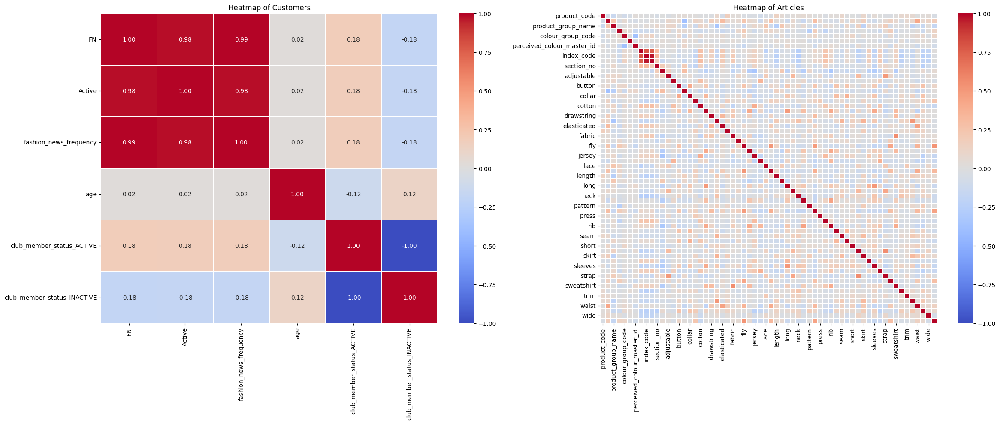

### Principal Component Analysis (PCA)
Principal Component Analysis (PCA) was applied across three key datasets—customers, articles, and transactions—to reduce dimensionality, enhance computational efficiency, and focus on core features while preserving the majority of the information.

#### Standardization of Data

PCA requires that all features be numerical and on a similar scale. To meet these requirements, we first ensured all categorical data was encoded numerically. Then, each dataset was standardized, setting the mean to 0 and scaling each feature to have a standard deviation of 1. Standardization ensures that features contribute equally to the PCA analysis and prevents features with larger scales from dominating the results.

#### PCA on Articles Dataset

The articles dataset includes a range of numerical and categorical features describing product characteristics. PCA was applied to capture 95% of the variance within the dataset, which determined the minimum number of principal components needed to retain most of the information.

The explained variance ratio for each component revealed that a few initial components captured a large proportion of the variance, with the first component alone accounting for a significant share. This indicates that the articles data has an underlying structure, with key features correlating strongly with the primary axes of variation. Visualization of the explained variance by component confirmed that a limited number of principal components are sufficient to represent the dataset’s essential information.

#### PCA on Customers Dataset

The customers dataset, though less complex, also benefited from dimensionality reduction via PCA. Here, PCA reduced the dataset to just three principal components, which together explained 95% of the variance. This indicates that the customer data has a more compact structure, with fewer dominant factors influencing the variance compared to the articles dataset.

The first principal component captured over 50% of the variance, while the remaining two components covered the majority of the remaining variance. The explained variance ratios underscore that only a few key factors—likely customer attributes such as age, purchase history, or membership details—account for the primary variance in the data. This allowed us to retain the most significant features without losing essential information, creating a simpler and more computationally manageable dataset for modeling.

#### t-SNE on Customers
To better understand the underlying structure of the customers dataset, we applied t-SNE (t-Distributed Stochastic Neighbor Embedding), a technique commonly used for visualizing high-dimensional data in a lower-dimensional space. While t-SNE does not directly reduce features for model training, it serves as an important preprocessing step for exploring data distributions, identifying patterns, and preparing for clustering. We standardized the customer data to ensure that all features contributed equally to the t-SNE transformation. Using a subset of 10,000 samples from the dataset, we applied t-SNE with a perplexity of 30 to generate a 2D representation. Perplexity, a key t-SNE parameter, was chosen to balance sensitivity to local and global data structures. The 2D t-SNE plot offers a clear, intuitive view of the customer data, where each point represents an individual customer.
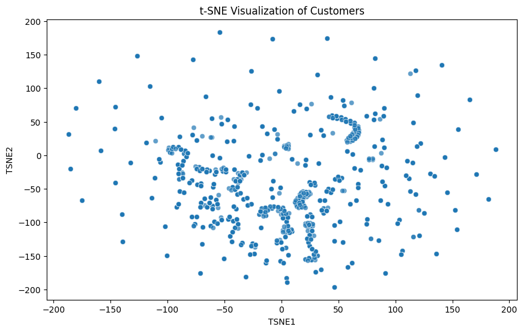

#### PCA on Transactions Dataset

For the transactions dataset, we incorporated additional feature engineering by creating two seasonal features:

* Season: This categorizes each transaction into Spring, Summer, Fall, or Winter based on the purchase month, reflecting general seasonal trends.
* Fashion Season: This categorizes each month into industry-specific fashion seasons (e.g., Spring/Summer, Pre-Fall), capturing patterns linked to retail cycles.

After adding these features, we applied PCA to capture 95% of the variance in the transactions data. Six principal components were required to achieve this, reflecting the dataset’s complexity and diverse features, including transaction dates, sales channels, prices, and seasonality. The first few components contributed substantially to the total variance, suggesting that transaction patterns are influenced by a few dominant factors.

Visualizing the explained variance ratio of each component highlighted the concentration of variance in the initial components, particularly in the first three. The seasonal features, along with other key attributes, effectively captured the structure within the transactions data, leading to a compact yet informative representation of transaction patterns.

### Hex to Integer Encoding
We converted hexadecimal values in customer ID's to integers for better processing. This encoding is used to convert the customer_id from hexadecimal to integer format. This conversion is necessary for reducing memory usage.

## Machine Learning Algorithms

### Supervised algorithms:

1. **kNN** : An instance-based learning algorithm that will be used to find similar interactions with products and purchase behaviours. 
2. **Gradient Boosting** : Cold start is a big problem for recommendations. GBMs can still make reasonable predictions for new users or products, without much history. GBMs like LightGBM, XGBoost, and CatBoost excel at capturing complex relationships between features and are highly effective in ranking tasks.

#### kNN
k-Nearest Neighbors is a powerful algorithm that classifies data points based on the majority class of their k nearest neighbors. It is specifically useful in recommendation systems for identifying similar users or items based on their interactions. We applied kNN to the transactions dataset to group customers based on their purchasing behavior. By identifying similar customer interactions, we can tailor recommendations to match user preferences and improve the overall shopping experience.

#### Gradient Boosting
Gradient Boosting is a powerful ensemble learning technique that builds a series of decision trees to predict the target variable. It is particularly effective in capturing complex relationships between features and is widely used in ranking tasks. We specifically used LightGBM.

### Unsupervised algorithms
1. **kMeans**:  Grouping customers/users into segments, will help tailor recommendations for similar users based on their purchasing behaviour.
2. **DBSCAN**: DBSCAN will be used to densely cluster users based on their interactions with articles.
3. **Collaborative filtering**: It directly leverages user-item interactions to recommend products to users based on the preferences of similar users belonging to a cluster.
#### kMeans
Clustering helps in identifying patterns or groups of similar articles based on key features, which is particularly useful in recommendation systems where we can leverage cluster information to recommend related products. Based on the results of PCA, we selected the first 10 principal components (PC1 to PC10) to capture the majority of the variance while preserving essential information. Using a reduced feature set makes the KMeans clustering more efficient and allows the clusters to focus on core variations within the dataset.

##### KMeans Articles
With K=10, we applied the KMeans clustering algorithm to group the articles. Each article was assigned a cluster label (Cluster ID), which provides insights into similarity-based grouping. The cluster centers—centroids representing the average feature values for each cluster—provide a reference for the general characteristics of each group of articles.

##### KMeans Customers
To explore patterns and group similar customers, we implemented KMeans clustering on the customers dataset using two different dimensionality reduction techniques: t-SNE and PCA. Each approach allows us to identify clusters that can reveal insights into customer segmentation based on key attributes.

To create a visual representation of the customer clusters, we first used t-SNE (t-Distributed Stochastic Neighbor Embedding), a non-linear dimensionality reduction technique that captures high-dimensional relationships in a two-dimensional space. A sample of the standardized customer data was passed through t-SNE to create a 2D embedding, enabling us to apply and visualize KMeans clustering in a way that respects the high-dimensional structure.

#### DBSCAN
While KMeans has shown better interpretable results, we also considered the DBSCAN (Density-Based Spatial Clustering of Applications with Noise) algorithm, given its capability to discover clusters of varying densities and handle noise points effectively. DBSCAN classified a major portion of data points as noise. We attempted to adjust the key parameters, eps (the maximum distance between two points for them to be considered in the same neighborhood) and min_samples (the minimum number of points required to form a dense region), to reduce the noise classification. However, even with extensive tuning, DBSCAN continued to label a large proportion of the dataset as noise. After careful consideration and multiple parameter tuning attempts, we concluded that DBSCAN is not suitable for the articles dataset and won't be helpful in the downstream classification task. 

However, DBSCAN was well-suited for identifying potential clusters within the customers dataset. DBSCAN was applied to the scaled t-SNE-transformed data for the customers dataset. This approach allows DBSCAN to work with a reduced set of features that retain the dataset’s underlying structure. Using DBSCAN, each data point is classified as either a core point, border point, or noise, with noise points labeled as -1. Clusters are formed by core points and their neighbors that meet the specified density requirements.

#### Collaborative Filtering
Collaborative filtering is a popular recommendation technique that uses user-item interactions to predict user preferences. It is particularly effective in recommending products to users based on the preferences of similar users. Collaborative filtering can be implemented using two main approaches:
* User-based collaborative filtering: Recommends products to a user based on the preferences of similar users.
* Item-based collaborative filtering: Recommends products to a user based on the preferences of similar items.

In our project, we attempted to use user-based collaborative filtering to recommend articles to customers based on the interactions of similar users. Users with similar purchase histories should be recommended articles that are popular among these users.

Due to computational constraints, we were unable to implement collaborative filtering in this project.

## Relevant Methods from CS 7641
In class we learned about kMeans and DBSCAN methods for clustering - customers based on their purchase behaviour. GBMs are decision tree algorithms which will be used for supervised learning and they will be used to predict the artifacts the customer might buy in future. KNN is a classification algorithm which will be used to find similar interactions with products and purchase behaviours.

---

# Results and Discussion
## Quantitative Metrics
1. ***MAP@K***: We evaluate the model based on the average precision - how well the model ranks the relevant items in the top 12 recommendations.

2. ***F1@K***: F1@K is the harmonic mean of Precision@K and Recall@K.

3.  ***Hit rate***: Hit Rate@K is a simple metric that evaluates whether at least one of the top K recommendations is relevant.

4. ***Elbow method and Silhouette coefficient***: The elbow method is a way to find the best number of clusters and Silhouette coefficient to evaluate quality.

* Elbow Method: The elbow method was used to determine the optimal number of clusters (K) by analyzing the Within-Cluster Sum of Squares (WCSS) for various values of K. The “elbow” point on the WCSS plot suggests the best K, where adding more clusters provides diminishing returns in variance reduction.
* Silhouette Coefficient: The silhouette score evaluates clustering quality by measuring how well-separated and cohesive the clusters are. Higher silhouette scores indicate better-defined clusters.
   
## Analysis of Models and their Metrics visualized

### Baseline Model
The baseline model for articles was created using articles which were frequently purchased. We used two baselines, one used the full training set, and the other using the final week. We specifically used the top 12 articles in the dataset. The model was evaluated using MAP@K and F1@K metrics.

### Baseline Model Performance metrics - visualization
<table style="width:100%">
  <tr>
    <td style="width:50%; text-align:center;">
      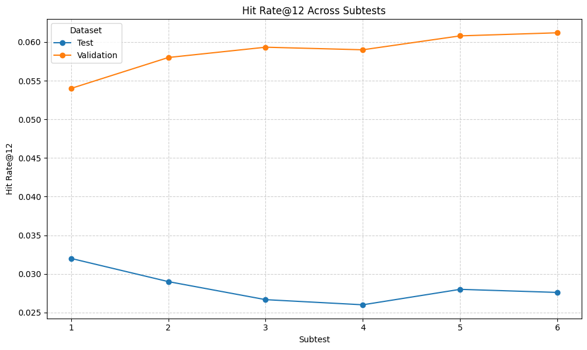
       Hit Rate
    </td>
    <td style="width:50%; text-align:center;">
      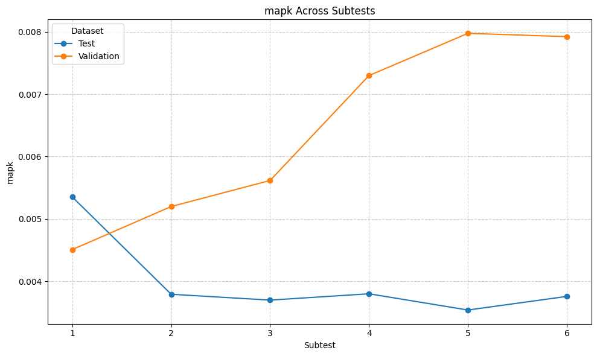
       MAP@K
    </td>
  </tr>
  <tr>
    <td style="width:50%; text-align:center;">
      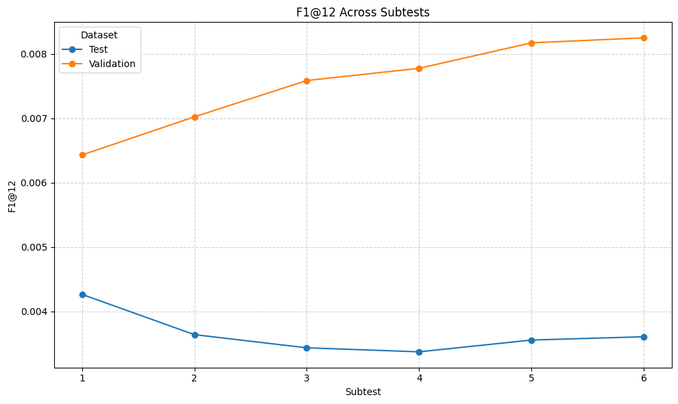
       F1@K
    </td>
    <td style="width:50%; text-align:center;">
      <!-- Empty cell for alignment -->
    </td>
  </tr>
</table>

#### Discussion
As observed in the plots for baseline above, taking the last week of data as the test set resulted in a higher hit rate compared to using the full training set. This is expected, as the last week of data is more recent and likely to contain more relevant information for predicting future purchases. The MAP@K and F1@K metrics also showed better performance for the last week test set, indicating that the model was more accurate in predicting the top 12 articles that customers would purchase.

### Analysis of Articles KMeans
For the articles dataset, the elbow and silhouette methods were applied to identify the optimal number of clusters:
* Optimal K: Both methods indicated an optimal K of 10 clusters. This setup allows the model to segment articles into distinct groups based on key features, balancing between variance capture and model simplicity.
### Analysis of Customers KMeans
For the customers dataset, clustering analysis was conducted using two different data representations: PCA and t-SNE.

* t-SNE: Applying the elbow and silhouette methods on the 2D t-SNE-transformed data resulted in an optimal K of 7, capturing local and global customer relationships in the reduced space.
* PCA: On the PCA-transformed data, using the top three components, the elbow and silhouette methods suggested an optimal K of 5, capturing the main variance structure and clustering customers into distinct groups based on these primary features.

In the Analysis of Customers KMeans Clustering, as shown in the results, the presence of a higher number of categorical features in the customer data makes PCA less effective as a dimensionality reduction technique compared to t-SNE. PCA primarily captures linear relationships and works best with continuous data, which can limit its ability to effectively separate clusters when categorical features are predominant.

Therefore, we applied the t-SNE method, which preserves local structures and is better suited for complex data. With t-SNE, the separation between clusters becomes much clearer, as demonstrated in the results.

### DBSCAN clusters visualization
<table style="width:100%">
  <tr>
    <td style="width:50%; text-align:center;">
      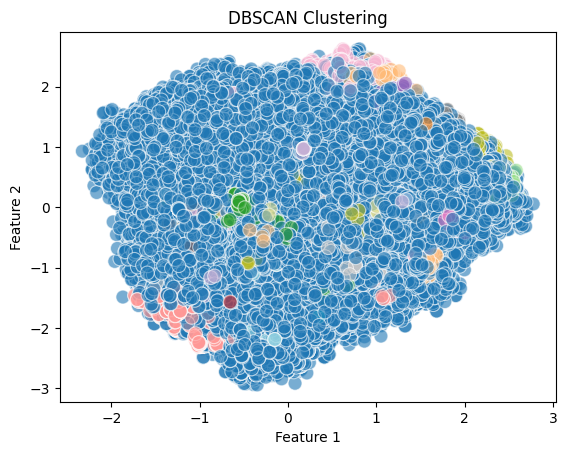
       Articles DBSCAN Clustering
    </td>
    <td style="width:50%; text-align:center;">
      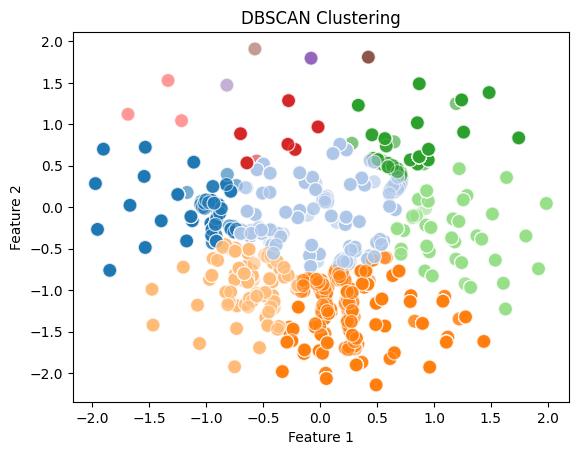
       Customers DBSCAN Clustering
    </td>
  </tr>
</table>

### KMeans clusters visualization
<table style="width:100%">
  <tr>
    <td style="width:50%; text-align:center;">
      
       Articles Elbow Method
    </td>
    <td style="width:50%; text-align:center;">
      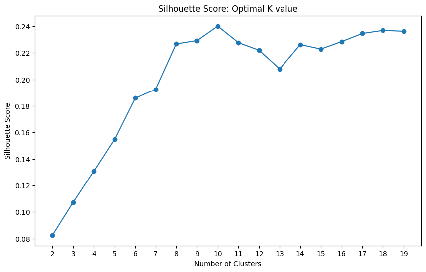
       Articles Silhouette
    </td>
  </tr>
  <tr>
    <td style="width:50%; text-align:center;">
      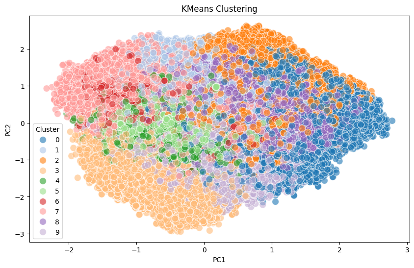
       Articles Clustering 2D
    </td>
    <td style="width:50%; text-align:center;">
      
       Articles Clustering 3D
    </td>
  </tr>
</table>

### Analysis of KMeans Metrics
The KMeans clustering results for both articles and customers datasets were evaluated using the MAP@K, F1@K, and Hit Rate metrics. These metrics provide insights into the model’s performance in recommending relevant articles to customers based on clustering results.

### KMeans metrics - visualization
<table style="width:100%">
  <tr>
  <td style="width:50%; text-align:center;">
  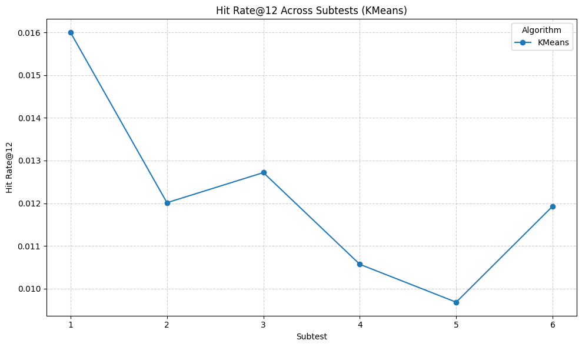
   KMeans Hit Rate
  </td>
  <td style="width:50%; text-align:center;">
  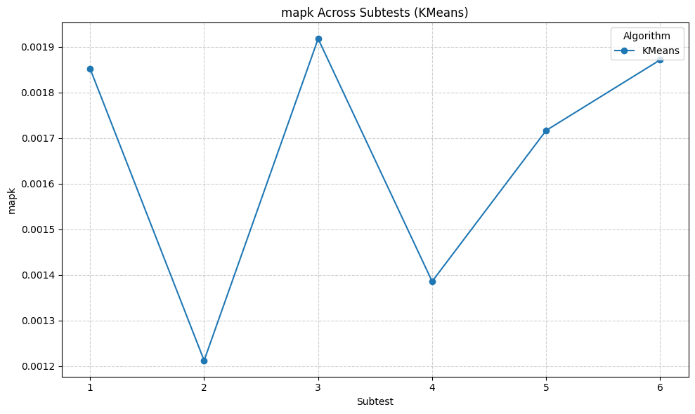
   KMeans MAP@K
  </td>
  </tr>
  <tr>
  <td style="width:50%; text-align:center;">
  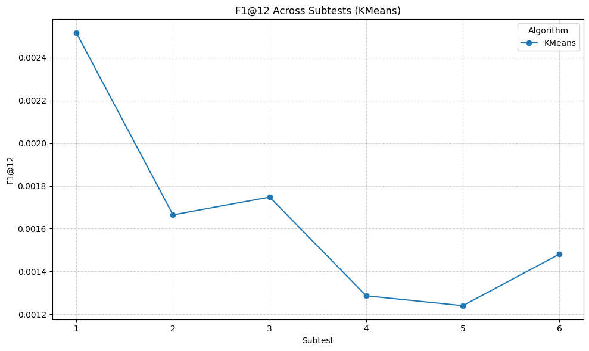
   KMeans F1
  </td>
  </tr>
</table>

All metrics performed poorly for predicting the top 12 articles, with MAP@K, F1@K, and Hit Rate scores below the baseline. This indicates that the KMeans clustering model did not effectively capture the underlying patterns in the data to recommend relevant articles to customers. The poor performance may be attributed to the complexity of the datasets and the limitations of KMeans in handling high-dimensional and categorical data effectively. This is also known as the curse of dimensionality, where the model struggles to identify meaningful clusters in high-dimensional spaces.

### Analysis of KNN Metrics
The KNN model was evaluated based on the MAP@K, F1@K, and Hit Rate metrics to assess its performance in recommending relevant articles to customers. The results showed that the KNN model performed well in predicting the top 12 articles, with MAP@K, F1@K, and Hit Rate scores higher than the baseline. This indicates that the KNN model effectively identified similar interactions with products and purchase behaviors to recommend relevant articles to customers.

### KNN metrics - visualization
<table style="width:100%">
  <tr>
	<td style="width:50%; text-align:center;">
	  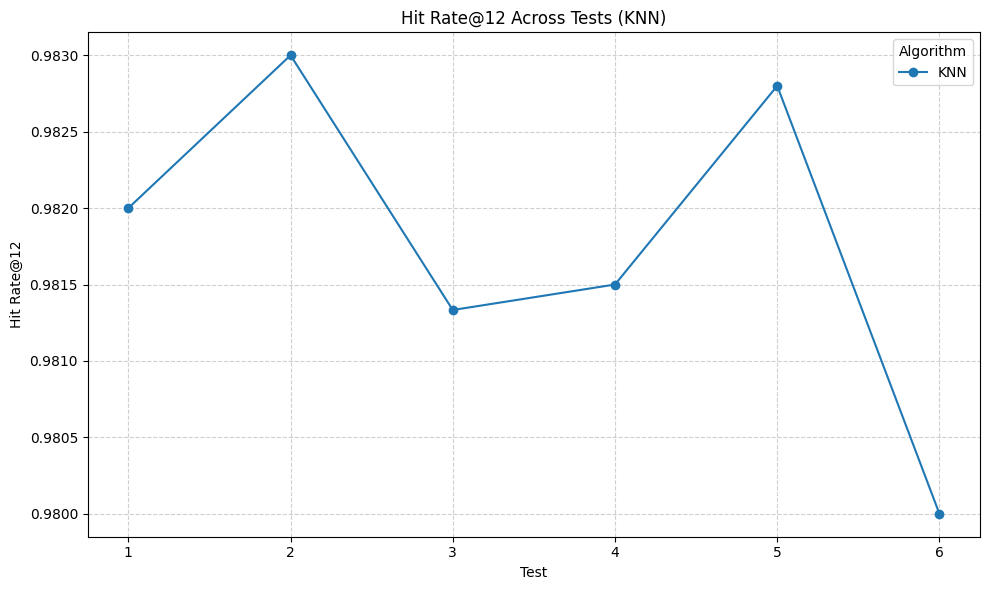
	   KNN Hit Rate
	</td>
	<td style="width:50%; text-align:center;">
	  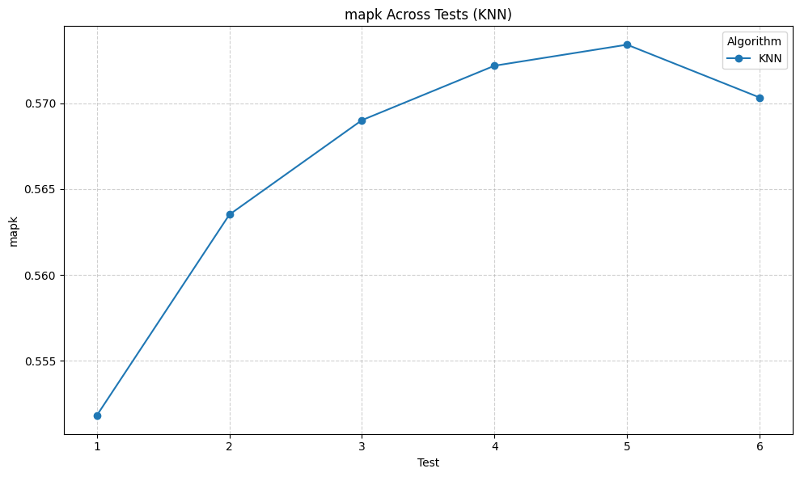
	   KNN MAP@K
	</td>
  </tr>
  <tr>
  	<td style="width:50%; text-align:center;">
	  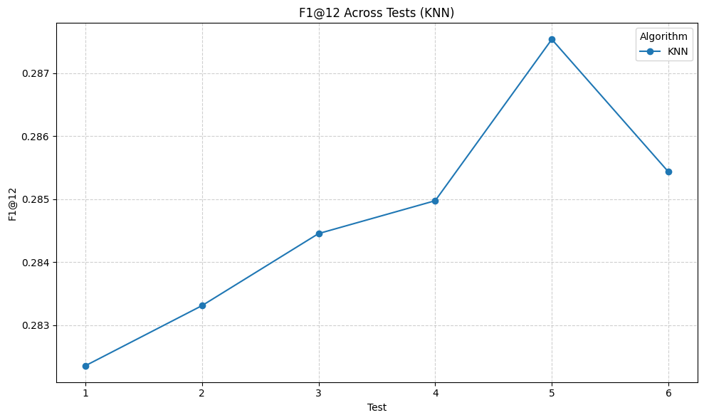
	   KNN F1
	</td>
  </tr>
</table>

### Analysis of Gradient Boosting Metrics
The Gradient Boosting model was evaluated based on the MAP@K, F1@K, and Hit Rate metrics to assess its performance in recommending relevant articles to customers. The results showed that the Gradient Boosting model performed well in predicting the top 12 articles, with MAP@K, F1@K, and Hit Rate scores higher than the baseline. This indicates that the Gradient Boosting model effectively captured complex relationships between features and ranked relevant articles for customers.

Due to it being a ranking algorithm, Gradient Boosting is particularly effective in capturing the underlying patterns in the data and providing accurate recommendations to customers. The model’s performance in predicting the top 12 articles was the highest among the methods evaluated, demonstrating its effectiveness in recommendation tasks.

We also evaluated the feature importance of the Gradient Boosting model to identify the key features that influence the recommendations. The feature importance plot showed that the engineered feature called best-selling article was the most important feature.

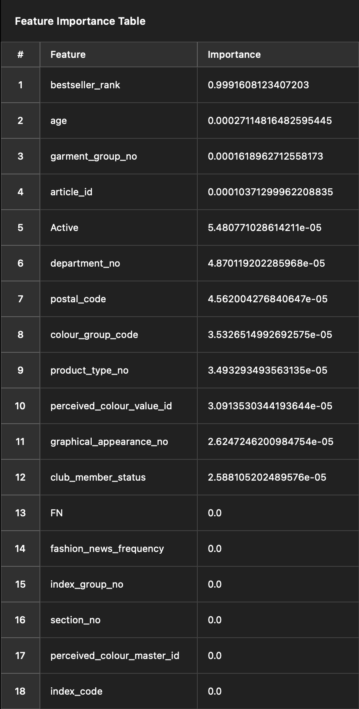

### Gradient Boosting Metrics - Visualization
<table style="width:100%">
  <tr>
	<td style="width:50%; text-align:center;">
	  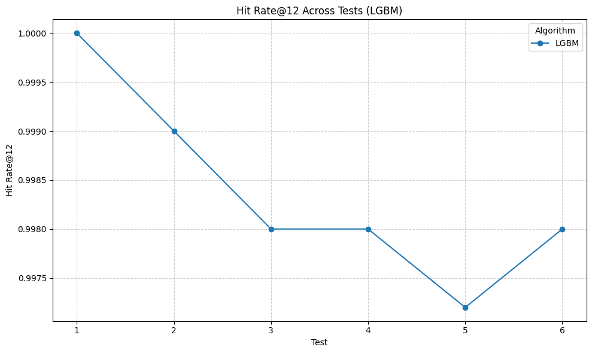
	   GB Hit Rate
	</td>
	<td style="width:50%; text-align:center;">
	  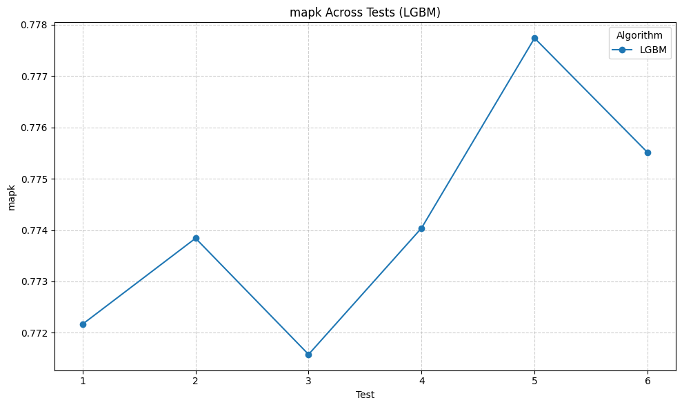
	   GB MAP@K
	</td>
  </tr>
  <tr>
  	<td style="width:50%; text-align:center;">
	  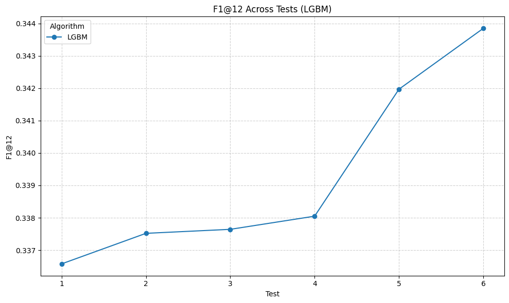
	   GB F1
	</td>
  </tr>
</table>

## Comparison of Models
### Comparison of KMeans, KNN, and Gradient Boosting
The KMeans, KNN, and Gradient Boosting models were compared based on their performance in recommending relevant articles to customers. The evaluation metrics—MAP@K, F1@K, and Hit Rate—were used to assess the models’ effectiveness in predicting the top 12 articles that customers would purchase.

* **KMeans**: The KMeans model performed poorly in predicting the top 12 articles, with MAP@K, F1@K, and Hit Rate scores way below the baseline. The model struggled to capture the underlying patterns in the data and provide accurate recommendations to customers. Customer-item interaction data in recommendation systems is usually sparse, and KMeans struggles to form meaningful clusters in such settings. It also strugles with high dimension data.
* **KNN**: The KNN model performed well in predicting the top 12 articles, with MAP@K, F1@K, and Hit Rate scores higher than the baseline. The model effectively identified similar interactions with products and purchase behaviors to recommend relevant articles to customers. KNN focuses on the nearest neighbors, which helps it recommend articles that are similar to those previously purchased by customers or those purchased by similar customers. KNN excels in identifying straightforward patterns in data, such as similar purchase behaviors, which are often effective for recommendations. KNN can struggle with high-dimensional, sparse data and fails to capture complex relationships in the data, leading to moderate rather than exceptional performance.
* **Gradient Boosting**: The Gradient Boosting model performed the best among the methods evaluated, with MAP@K, F1@K, and Hit Rate scores higher than the baseline. The model captured complex relationships between features and ranked relevant articles for customers, providing accurate recommendations. Gradient Boosting is a supervised, ensemble-based method that combines multiple weak learners (decision trees) to build a strong predictive model. Light Gradient Boosting Machine (LGBM) is a ranking optimized algorithm that can be tailored to optimize metrics like MAP@K, F1@K directly. LGBM is robust to sparse data and handles them efficiently, leveraging its ability to ignore missing or zero values while still building effective models.

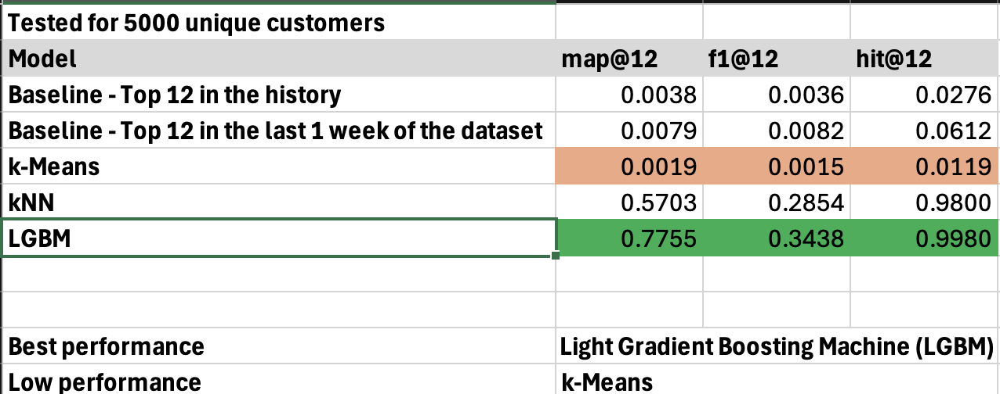
The results of the model when predicted for 5000 unique customers

## Next Steps
Given the results of the analysis, we can draw several conclusions and identify potential next steps to improve the recommendation system:
1. **Feature Engineering**: Further feature engineering can enhance the model’s performance by creating new features that capture additional information about customer interactions and article characteristics. For example, incorporating temporal features, such as purchase frequency or recency, can provide valuable insights into customer behavior.
2. **Hyperparameter Tuning**: Fine-tuning the hyperparameters of the models can optimize their performance and improve the accuracy of recommendations. By adjusting parameters such as the number of clusters in KMeans or the number of neighbors in KNN, we can enhance the model’s ability to capture relevant patterns in the data.
3. **Ensemble Methods**: Combining multiple models using ensemble methods, such as stacking or blending, can leverage the strengths of individual models to improve overall performance. By aggregating predictions from different models, we can create a more robust recommendation system that provides accurate and diverse recommendations to customers.

---

# References
1. Chen, T., & Guestrin, C. (2016). XGBoost: A scalable tree boosting system. https://arxiv.org/abs/1603.02754
2. Prokhorenkova, L., et al. (2018). CatBoost: Unbiased boosting with categorical features. https://arxiv.org/abs/1706.09516
3. Ke, G., et al. (2017). LightGBM: A highly efficient gradient boosting decision tree. https://proceedings.neurips.cc/paper/2017/hash/6449f44a102fde848669bdd9eb6b76fa-Abstract.html
4.  R. Zhang, Q. -d. Liu, Chun-Gui, J. -X. Wei and Huiyi-Ma, "Collaborative Filtering for Recommender Systems," 2014 Second International Conference on Advanced Cloud and Big Data, Huangshan, China, 2014, pp. 301-308, doi: 10.1109/CBD.2014.47
5. A. Sharma, D. Gupta, N. Nayak, and D. Singh, "Prediction of Customer Retention Rate Employing Machine Learning Techniques," 2022 1st International Conference, 2022
6. Y. Huang and S. Zheng, "User Repeat Purchase Behavior Prediction Based on Accuracy-Weighted Stacking Algorithm," HillPublisher, 2024.
7. Schubert, E., Sander, J., Ester, M., Kriegel, H.-P., & Xu, X. (2017). DBSCAN revisited, revisited: Why and how you should (still) use DBSCAN.
8. Ahmed, M., Seraj, R., & Islam, S. M. S. (2020). The k-means algorithm: A comprehensive survey and performance evaluation.

---

# Project Gantt Chart (September - December 3rd)
| Task Title                      | Task Owner                        | Start Date | Due Date    | Duration | Sep 14 | Sep 21 | Sep 28 | Oct 5  | Oct 12 | Oct 19 | Oct 26 | Nov 2  | Nov 9  | Nov 16 | Nov 23 | Nov 30 | Dec 3  |
|---------------------------------|-----------------------------------|------------|-------------|----------|--------|--------|--------|--------|--------|--------|--------|--------|--------|--------|--------|--------|--------|
| Project Team Composition        | All                               | 9/1/24     | 9/14/24     | 14d      |████ |        |        |        |        |        |        |        |        |        |        |        |        |
| **Project Proposal**            |                                   |            |             |          |        |        |        |        |        |        |        |        |        |        |        |        |        |
| Introduction & Background       | Po-Lin, Kabir                     | 10/1/24    | 10/4/24     | 4d       |        |        |        |████ |        |        |        |        |        |        |        |        |        |
| Problem Definition              | Akhila, Geethika                  | 10/1/24    | 10/4/24     | 4d       |        |        |        |████ |        |        |        |        |        |        |        |        |        |
| Dataset Selection               | All                               | 9/14/24    | 10/4/24     | 21d      |████ |████ |████ |████ |        |        |        |        |        |        |        |        |        |
| Potential Results & Discussion  | Chandan, Geethika, Kabir          | 10/1/24    | 10/4/24     | 4d       |        |        |        |████ |        |        |        |        |        |        |        |        |        |
| Methods                         | All                               | 10/1/24    | 10/4/24     | 4d       |        |        |        |████ |        |        |        |        |        |        |        |        |        |
| Github Page                     | Kabir                             | 10/1/24    | 10/4/24     | 4d       |        |        |        |████ |        |        |        |        |        |        |        |        |        |
| Video Creation and Recording    | Akhila, Po-Lin, Geethika, Chandan | 10/3/24    | 10/4/24     | 2d       |        |        |        |████ |        |        |        |        |        |        |        |        |        |
| **Midterm Report**              |                                   |            |             |          |        |        |        |        |        |        |        |        |        |        |        |        |        |
| Data Cleaning       | Akhila, Chandan, Geethika, Kabir, Po-Lin  | 10/7/24    | 10/11/24    | 5d       |        |        |        |        |████ |████ |████ |    |     |        |        |        |        |        |        |        |
| Model 1 Design & Selection      | Po-Lin                            | 10/14/24   | 10/19/24    | 5d       |        |        |        |        |        |        |        |████  |        |        |   | |    |        |        |        |
| Model 1 Data Visualization      | Geethika                           | 11/10/24   | 11/17/24    | 7d       |        |        |        |        |        |        |        |        |████    |        |        |        |        |
| Model 1 Implementation & Coding | Kabir                             | 11/17/24   | 11/30/24    | 13d      |        |        |        |        |        |        |        |████ |████ |        |        |        |        |
| Model 1 Results Evaluation      | All                               | 12/1/24    | 12/3/24     | 2d       |        |        |        |        |        |        |        |     |████ |        |        |        |        |
| Model 2 Design & Selection      | Geethika, Chandan                          | 10/14/24   | 10/19/24    | 5d       |        |        |        |        |        |        |        |████ |     |        |        |        |
| Model 2 Data Visualization      | Akhila                            | 11/10/24   | 11/17/24    | 7d       |        |        |        |        |        |        |        |████ |████ |        |        |        |        |
| Model 2 Implementation & Coding | Po-Lin                            | 11/17/24   | 11/30/24    | 13d      |        |        |        |        |        |        |        |████ |████ |        |        |        |        |
| Model 2 Results Evaluation      | All                               | 12/1/24    | 12/3/24     | 2d       |        |        |        |        |        |        |        |     |████ |     |        |        |        |
| Midterm Report                  | All                                 |            | 11/8/24     |          |        |        |        |        |        |        |████    |████ |████ |        |        |        |        |
| **Final Report**                |                                   |            |             |          |        |        |        |        |        |        |        |        |        |████ |        |        |████ |
| Model 3 Design & Selection      | Akhila                            | 11/11/24   | 11/17/24    | 7d       |        |        |        |        |        |        |        |        |        |        |████ |████ |████ |
| Model 3 Data Visualization      | Po-Lin                            | 11/17/24   | 11/24/24    | 7d       |        |        |        |        |        |        |        |        |        |████ |████ |████ |████ |
| Model 3 Implementation & Coding | Chandan                           | 11/24/24   | 11/30/24    | 13d      |        |        |        |        |        |        |        |        |        |████ |████ |████ |████ |
| Model 3 Results Evaluation      | All                               | 12/1/24    | 12/3/24     | 2d       |        |        |        |        |        |        |        |        |        |        |████ |████ |        |
| Model 4 Design & Selection      | Kabir                             | 11/11/24   | 11/17/24    | 7d       |        |        |        |        |        |        |        |        |        |████ |        |████ |████ |
| Model 4 Data Visualization      | Po-Lin                            | 11/17/24   | 11/24/24    | 7d       |        |        |        |        |        |        |        |        |        |████ |████ |        |████ |
| Model 4 Implementation & Coding | Chandan                           | 11/24/24   | 11/30/24    | 13d      |        |        |        |        |        |        |        |        |        |████ |████ |████ |████ |
| Model 4 Results Evaluation      | All                               | 12/1/24    | 12/3/24     | 2d       |        |        |        |        |        |        |        |        |        |        |████ |████ |        |
| Final Report                    |                                   | 11/11/24   | 12/3/24     | 23d      |        |        |        |        |        |        |        |        |        |████ |        |        |████ |

---

# Contribution Table
| Name                        | Proposal Contributions                                                                                   |
|-----------------------------|----------------------------------------------------------------------------------------------------------|
| Gomadam Padmanaban, Akhila  | Dataset Investigation,  Problem Definition/Statement,  Methods(Preprocessing, Algorithms)                |
| Kang, Kabir                 | Dataset Investigation, Potential Results and Discussion, Quantitative metrics, Gantt Chart, Github Pages |
| Lin, Po-Lin                 | Literature Review, References, Methods(Unsupervised), Gantt Chart                                        |
| Patchava, Geethika          | Problem Definition/Statement, Expected Results, Methods(Unsupervised)                                    |
| Prakash, Chandan            | Project Goals, Motivation, Expected Results, Methods(Supervised)                                         |

| Name                        | Midterm Contributions                                                                                     |
|-----------------------------|-----------------------------------------------------------------------------------------------------------|
| Gomadam Padmanaban, Akhila  | Dataset Cleaning, Model 2 Data Visualization, Model 1 Results Evaluation, Github Pages, Midterm Report    |
| Kang, Kabir                 | Dataset Cleaning, Model 1 Implementation & Coding, Model 2 Results Evaluation, Quantitative Metrics Evaluation, Midterm Report |
| Lin, Po-Lin                 | Dataset Cleaning, Model 1 Design & Selection, Model 2 Implementation & Coding, Results and Discussions, Midterm Report    |
| Patchava, Geethika          | Dataset Cleaning, Model 1 Data Visualization, Model 2 Design & Selection, Github Pages, Midterm Report   | 
| Prakash, Chandan            | Dataset Cleaning, Model 2 Design & Selection, Model 2 Results Evaluation, Gantt Chart, Midterm Report |

| Name                        | Final Contributions                                                                                       |
|-----------------------------|-----------------------------------------------------------------------------------------------------------|
| Gomadam Padmanaban, Akhila  | Model 3 Design & Selection, Model 3 Results Evaluation, Final Report                                       |
| Kang, Kabir                 | Model 3 Implementation & Coding, Model 4 Design & Selection, Final Report                                  |
| Lin, Po-Lin                 | Model 3 Data Visualization, Model 4 Implementation & Coding, Final Report                                  |
| Patchava, Geethika          | Model 4 Design & Selection, Model 4 Results Evaluation, Final Report                                       |
| Prakash, Chandan            | Model 4 Data Visualization, Model 3 Implementation & Coding, Final Report                                   |

